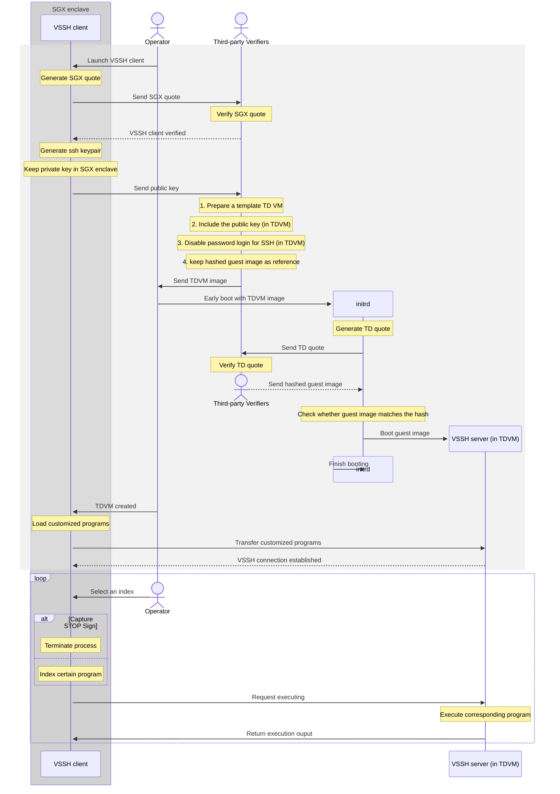

# Verifiable SSH
a SSH-based service that provides the only access to TD (Trust Domain) VM using a SSH client protected by an SGX (Software Guard Extenstions) enclave, where multi-party could verify the boot process of TD VM and the launch of VSSH client.

## Overview

VSSH consists of three components: VSSH client, VSSH server and Attestation service.
VSSH client running in a container protected by SGX enclave, acting as a standard SSH client that only recieves index to call corresponding command in SSH server. VSSH server is a standard SSH server in TD VM, but can only be accessed by VSSH client with its own SSH private key. Attestation Service/Verifiers running in each of the multi-party verification participants. Based on the verification results, participants can run a customized consensus to determine whether VSSH client and server are protected by SGX and TDVM, therefore trustworthy.


### Key Features

- SGX enclave and TDX for security
- Docker for easier deployment
- Mounted volume for data persistence
- SSH key verification for trustworthy
- Attestation service for verifiable

## Architechture

## System Flow



## Prerequisites

- Intel CPU with SGX and TDX support
- DCAP driver and related software stack
- Linux environment (this project has worked successfully with Ubuntu 22.04 LTS)

## Deployment 
Note: Please operate step 1- in a fully trusted environment


1. Clone the repository:
```bash
git clone https://github.com/elvis77-op/Verifiable_SSH.git
cd Verifiable_SSH
```

2. Generate Signing key pair for Verifier(need a python compilor):
```bash
python key_generate.py
```

3. Refer to <VSSH_client/README.md>

4. Refer to <Verifier/README.md>

## Usage


## Environment clean up
```bash
./clean_vssh.sh
```
## Current Phase
- [x] Basic connection of VSSH client and VSSH server
- [ ] Quote Verification for VSSH client
- [ ] Quote Verification for early boot of TD VM
  
## Future Work


### Security Enhancements
- [x] Remove insecure command-line arguments
- [ ] Add Quete Verification and Remote Attestation
  
### Feature Additions
- [ ] Add configuration for custom ssh command
  
### Architectural Improvements
- [ ] Create a configuration system for deployment flexibility

## Design Considerations for Future Versions

### Current Limitations