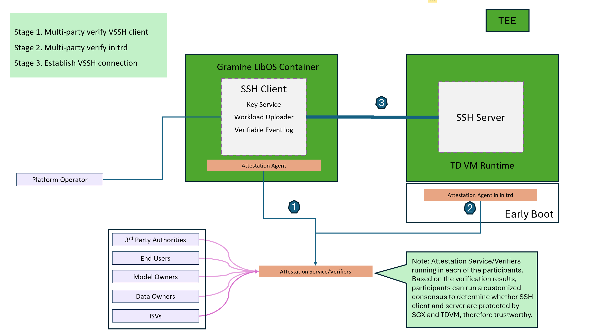
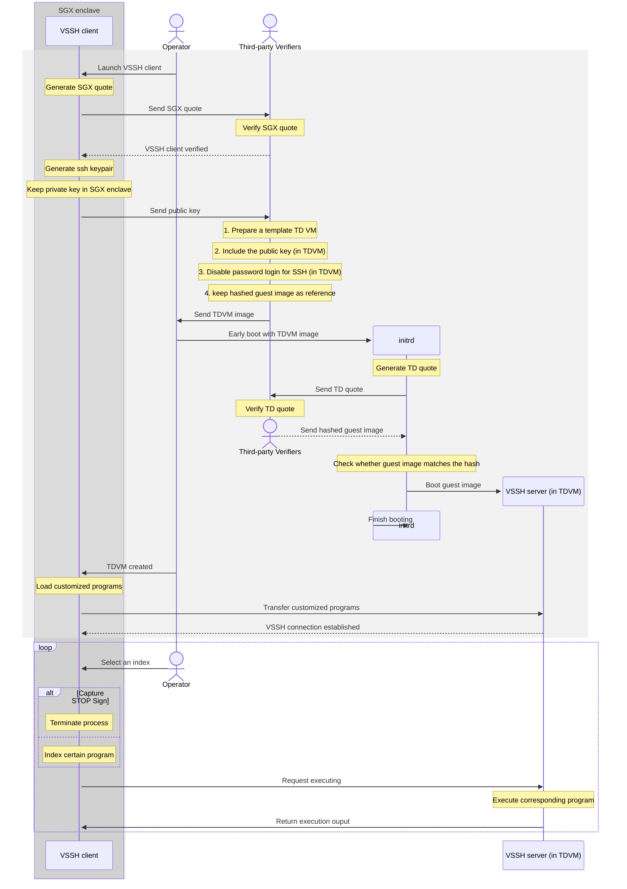

# Verifiable SSH
a SSH-based service that provides the only access to TD (Trust Domain) VM using a SSH client protected by an SGX (Software Guard Extenstions) enclave, where multi-party could verify the boot process of TD VM and the launch of VSSH client.

## Overview

VSSH consists of three components: VSSH client, VSSH server and Attestation service.
VSSH client running in a container protected by SGX enclave, acting as a standard SSH client that only recieves index to call corresponding command in SSH server. VSSH server is a standard SSH server in TD VM, but can only be accessed by VSSH client with its own SSH private key. Attestation Service/Verifiers running in each of the multi-party verification participants. Based on the verification results, participants can run a customized consensus to determine whether VSSH client and server are protected by SGX and TDVM, therefore trustworthy.


### Key Features

- SGX enclave and TDX for security
- Docker for easier deployment
- Mounted volume for data persistence
- SSH key verification for trustworthy
- Attestation service for verifiable

## Architechture

## System Flow



## Prerequisites

- Intel CPU with SGX and TDX support
- DCAP driver and related software stack
- Linux environment (this project has worked successfully with Ubuntu 22.04 LTS)

## Preamble
1. You need two hosts to operate with, one must meet the [prerequisites](#prerequisites) ,and the other one must be fully trusted

2. Clone the repository to the trusted host:
```bash
git clone https://github.com/elvis77-op/Verifiable_SSH.git
cd Verifiable_SSH
```

3. Generate signing key pair for Verifier(need python environment and related packages):
```bash
python key_generate.py
```
alternative methods that generate RSA key pairs (private key in PKCS#1 format and public key in X.509 certificate) are also accepted, where you need to store the keys in PEM format files
Be causious that when you modify the signing key paths, you may need to sync these changes in either config.py

4. Build VSSH client image
    1. Move the whole directory "VSSH_client" to the remote host that satisfy the [prerequisites](#prerequisites)
    2. Edit config.py
    3. Prepare customized scripts in ./scripts folder according to templates (ps, os-release, whoami)in it
    4. Define proxy and no_proxy in Dockerfile to help build the docker image (optional)
    5. ```bash chmod +x *.sh```
    6. ```bash ./build_vssh.sh ```

5. Build Verifier image
    1. ```bash cd ../Verifier ```
    2. Edit config.py (the value of mrenclave and mrsigner are printed in the console while building VSSH client image)
    3. ```bash python policy_update.py```
    4. Define the pccs server address in sgx_default_qcnl.conf and modify other config (except "use_secure_cert" = "false" ) based on local     environment 
    To install a local pccs service, refer to [PCCS installtion](https://github.com/intel/SGXDataCenterAttestationPrimitives/tree/main/QuoteGeneration/pccs)
    5. Define proxy and no_proxy in Dockerfile to help build the docker image (optional)
    6. ```bash chmod +x *.sh```
    7. ```bash ./build_verifier.sh```

## Usage
tips: Every changes to the code of VSSH_client will result in different mrenclave value, in which you need to rebuild Verifier image with the latest mrenclave value
1. Move to "Verifier" directory (where you build verifier image)
    ```bash ./launch_verifier.sh ```
2. Move to "VSSH_client" directory (where you build vssh client image )
    ```bash ./launch_vssh.sh ```
    - when you need to clean the ssh key pairs , run  ```bash ./clean_vssh.sh ```

## Environment clean up
```bash
./clean_vssh.sh
```
## Current Phase
- [x] Basic connection of VSSH client and VSSH server
- [x] Quote Verification for VSSH client
- [ ] Quote Verification for early boot of TD VM
  
## Future Work


### Security Enhancements
- [x] Remove insecure command-line arguments
- [ ] Add Quete Verification and Remote Attestation
  
### Feature Additions
- [ ] Add configuration for custom ssh command
  
### Architectural Improvements
- [x] Create a configuration system for deployment flexibility

## Design Considerations for Future Versions

### Current Limitations