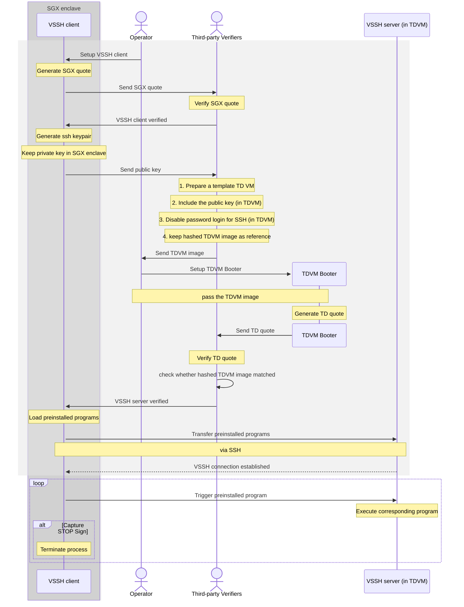

# Verifiable SSH
a SSH-based service that provides the only access to TD(Trust Domain) VM using an SGX (Software Guard Extenstions) enclave as SSH client, where multi-party could verify the initialization of TD VM and the setup of VSSH

## Overview

VSSH consists of three components: 


### Key Features

## Architechture


## System Flow


```mermaid
sequenceDiagram
    box rgb(200,200,200,0.5) SGX enclave
        participant VSSH as VSSH client
    end
    actor ADMIN as Operator
    actor VF as Third-party Verifiers

    rect rgb(230,230,230,0.5)
        ADMIN->>+VSSH: Setup VSSH client
        Note over VSSH: Generate SGX quote
        VSSH->>VF: Send SGX quote
        Note over VF: Verify SGX quote
        VF->>VSSH: VSSH client verified
        Note over VSSH: Generate ssh keypair
        Note over VSSH: Keep private key in SGX enclave
        VSSH->>VF: Send public key
        Note over VF: 1. Prepare a template TD VM
        Note over VF: 2. Include the public key (in TDVM)
        Note over VF: 3. Disable password login for SSH (in TDVM)
        Note over VF: 4. keep hashed TDVM image as reference
        VF->>ADMIN: Send TDVM image 
        create participant BOOT as TDVM Booter
        ADMIN->>BOOT: Setup TDVM Booter
        Note over ADMIN,BOOT: pass the TDVM image
        participant TDVM as VSSH server (in TDVM)
        Note over BOOT: Generate TD quote
        destroy BOOT
        BOOT->>VF: Send TD quote
        Note over VF: Verify TD quote 
        VF->>VF: check whether hashed TDVM image matched
        VF->>VSSH: VSSH server verified
        Note over VSSH: Load preinstalled programs
        VSSH->>TDVM: Transfer preinstalled programs
        Note over VSSH,TDVM: via SSH
        TDVM-->>VSSH: VSSH connection established
    end 

    
    loop 
        VSSH->>TDVM: Trigger preinstalled program
        Note over TDVM: Execute corresponding program
        alt Capture STOP Sign
        Note over VSSH: Terminate process
        end
    end
    
```

## Prerequisites

- Intel CPU with SGX and TDX support
- DCAP driver and related software stack
- Linux environment (this project has worked successfully with Ubuntu 22.04 LTS)

## Deployment

1. Clone the repository:
```bash
git clone https://github.com/elvis77-op/Verifiable_SSH.git
cd Verifiable_SSH
```

2. Add proxy in Dockerfile (optional)

3. Define the address and port of TDVM in main.sh

4. Build the project:
```bash
chmod +x *.sh
./build_vssh.sh
```
5. Run the project:
```bash
./launch_vssh.sh
```

## Environment clean up
```bash
./clean_vssh.sh
```

## Future Work

### Security Enhancements
- [ ] Remove insecure command-line arguments
- [ ] Add Quete Verification and Remote Attestation
  
### Feature Additions
- [ ] Add configuration for custom ssh command
  
### Architectural Improvements
- [ ] Create a configuration system for deployment flexibility

## Design Considerations for Future Versions

### Current Limitations